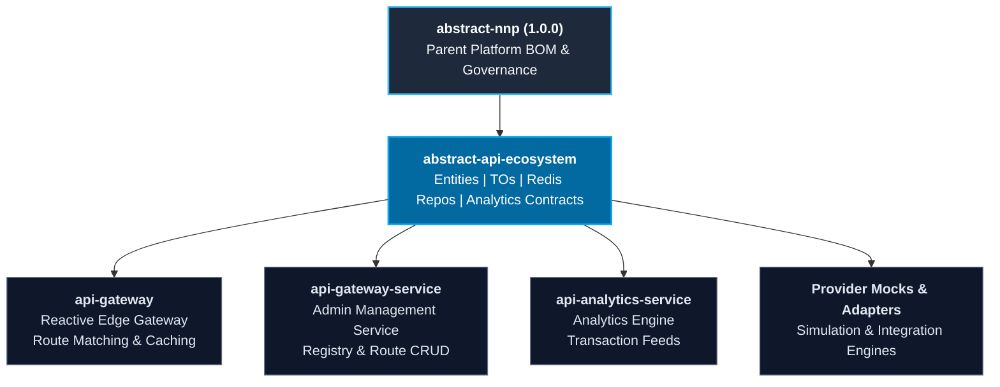

# PICC-PC-Abstract-API-Ecosystem
[](https://openjdk.org/projects/jdk/21/)
[](https://spring.io/projects/spring-boot)
[](https://spring.io/projects/spring-cloud)
[](LICENSE)
[]()

Enterprise Abstraction Library providing shared JPA domain entities, contract Transfer Objects (TOs), distributed Redis caching repositories, and API transaction event models for cloud-native API Ecosystem microservices across the Nubo Native Platform (NNP).

---

## Table of Contents

- [Overview](#overview)
- [Key Architectural Features](#key-architectural-features)
- [Architecture and Ecosystem](#architecture-and-ecosystem)
- [Technology Matrix](#technology-matrix)
- [Quick Start](#quick-start)
  - [Maven Dependency](#maven-dependency)
  - [Using JPA Entities and Transfer Objects](#using-jpa-entities-and-transfer-objects)
  - [Distributed Redis Caching](#distributed-redis-caching)
- [Project Documentation](#project-documentation)
- [Local Build and Installation](#local-build-and-installation)
- [Repository Structure](#repository-structure)
- [Security and Vulnerability Management](#security-and-vulnerability-management)
- [Contributing](#contributing)
- [License](#license)

---

## Overview

`abstract-api-ecosystem` delivers a unified, enterprise-grade abstraction layer for all microservices in the NNP API Ecosystem. By centralizing entity definitions, data transfer contracts, and distributed cache abstractions, it ensures strict contract compliance and seamless interoperability between gateway components, services, and analytics processors.

Key advantages include:
- **Consistent Data Contracts**: Standardizes representations of API routes, registries, organizations, service providers, logs, and error payloads across services.
- **Bi-Directional Transformation**: Pre-built mapping methods and ModelMapper configuration between JPA entities and Transfer Objects.
- **Pluggable Redis Caching**: Reusable `AbstractRedisRepo` abstraction enabling instant, type-safe Redis hash caching with zero boilerplate.
- **Zero Secrets & Config Injection**: Designed for containerized and cloud-native deployments with fallback defaults and environment variable placeholders.

---

## Key Architectural Features

- **Java 21 LTS Baseline**: Built and compiled for Java 21, taking advantage of modern language capabilities and virtual threads.
- **Jakarta EE 10 Alignment**: Pure Jakarta persistence (`jakarta.persistence.*`) and validation (`jakarta.validation.constraints.*`) compliance.
- **Spring Boot 3.5.x Parent Integration**: Inherits dependency management and CVE governance from `com.nubons:abstract-nnp:1.0.0`.
- **Connector-Agnostic Redis Support**: Works seamlessly with either Lettuce or Jedis connection pools.
- **Public Maven Distribution**: Distributed via GitHub Pages as an open-access public Maven repository with zero authentication barriers.

---

## Architecture and Ecosystem



---

## Technology Matrix

| Category | Component / Library | Version | Role / Description |
| :--- | :--- | :--- | :--- |
| **Runtime** | Java JDK | `21` | Long-Term Support (LTS) Java runtime |
| **Parent Platform** | `com.nubons:abstract-nnp` | `1.0.0` | Enterprise parent BOM and dependency governance |
| **Framework** | Spring Boot | `3.5.4` | Enterprise microservice framework |
| **Persistence** | `spring-boot-starter-data-jpa` | `3.5.4` | Jakarta Persistence / Hibernate data layer |
| **Distributed Cache** | `spring-boot-starter-data-redis` | `3.5.4` | Distributed caching and Redis template support |
| **Redis Clients** | `jedis` / Lettuce | `5.2.0` | Non-blocking and connection-pooled Redis drivers |
| **Object Mapping** | `modelmapper` | `3.2.4` | Flexible object transformation |
| **Validation** | `hibernate-validator` | `8.0.2` | Jakarta Bean Validation implementation |
| **Build & CI** | Maven & GitHub Actions | `3.9.9` | Automated testing, packaging, and gh-pages Maven deployment |

---

## Quick Start

### Maven Dependency

Add `abstract-api-ecosystem` to your downstream application's `pom.xml`:

```xml
<dependencies>
    <dependency>
        <groupId>com.nubons.nnp.sso.abstract</groupId>
        <artifactId>abstract-api-ecosystem</artifactId>
        <version>1.0.0</version>
    </dependency>
</dependencies>
```

Ensure the public NNP Maven repositories are declared in your `pom.xml` or `~/.m2/settings.xml`:

```xml
<repositories>
    <repository>
        <id>nnp-public-abstract-platform</id>
        <name>NNP Public Maven Repository - Abstract Platform</name>
        <url>https://nubo-native-platform.github.io/PICC-PC-Abstract-NNP-Platform/maven/</url>
    </repository>
    <repository>
        <id>nnp-public-abstract-api-ecosystem</id>
        <name>NNP Public Maven Repository - Abstract API Ecosystem</name>
        <url>https://nubo-native-platform.github.io/PICC-PC-Abstract-API-Ecosystem/maven/</url>
    </repository>
</repositories>
```

### Using JPA Entities and Transfer Objects

Convert effortlessly between JPA database entities and validated Transfer Objects:

```java
import com.nubons.nnp.sso.abs.entity.ApiOrganization;
import com.nubons.nnp.sso.abs.to.ApiOrganizationTO;

// Convert entity to TO
ApiOrganization entity = orgRepository.findById(orgId).orElseThrow();
ApiOrganizationTO to = ApiOrganizationTO.fromEntity(entity);

// Convert TO to new entity
ApiOrganization newEntity = ApiOrganizationTO.toEntity(to);
```

### Distributed Redis Caching

Implement custom hash caching repositories extending `AbstractRedisRepo`:

```java
import com.nubons.nnp.sso.abs.redis.blocking.core.AbstractRedisRepo;
import com.nubons.nnp.sso.abs.to.SampleTO;
import org.springframework.stereotype.Repository;

@Repository
public class SampleRedisRepo extends AbstractRedisRepo<String, SampleTO> {

    public void save(SampleTO sample) {
        repo().put("NNP.API-ECO.SAMPLE", sample.getId(), sample);
    }

    public SampleTO get(String id) {
        return repo().get("NNP.API-ECO.SAMPLE", id);
    }
}
```

---

## Project Documentation

Comprehensive documentation is provided across the repository:

- **[User Manual and Deployment Guide](USER_MANUAL_AND_DEPLOYMENT_GUIDE.md)**: Downstream usage patterns, Maven `settings.xml` setup, CI/CD automated deployment pipelines, and troubleshooting guides.
- **[Development Guidelines and Contribution Standards](DEVELOPMENT_GUIDELINES.md)**: Architecture governance, DTO/entity standards, Redis repository design, PR review checklists, and branching standards.
- **[Security Policy](SECURITY.md)**: Vulnerability disclosure workflow and zero-secrets policy.
- **[Maintainers Registry](MAINTAINERS.md)**: Core maintainers and project leadership.
- **[Code of Conduct](CODE_OF_CONDUCT.md)**: Community standards and pledge.

---

## Local Build and Installation

### Prerequisites
- JDK 21 (Temurin or OpenJDK)
- Apache Maven 3.9+ (or included `./mvnw`)

```bash
# Clone the repository
git clone https://github.com/Nubo-Native-Platform/PICC-PC-Abstract-API-Ecosystem.git
cd PICC-PC-Abstract-API-Ecosystem

# Validate the POM structure
./mvnw validate

# Run unit tests
./mvnw clean test

# Build and install into local Maven repository (~/.m2/repository)
./mvnw clean install
```

On Windows:
```cmd
build.bat
```

---

## Repository Structure

```
PICC-PC-Abstract-API-Ecosystem/
├── .github/
│   └── workflows/
│       └── ci-cd.yml                          # GitHub Actions CI/CD automation
├── .m2/
│   ├── settings.xml                           # Maven settings with public repo & placeholders
│   └── settings.sample.xml                    # Template for developers and CI/CD pipelines
├── .mvn/
│   └── wrapper/
│       └── maven-wrapper.properties           # Maven 3.9.9 wrapper configuration
├── src/
│   ├── main/java/com/nubons/nnp/sso/abs/
│   │   ├── constants/                         # API & Analytics constants
│   │   ├── entity/                            # Shared JPA entities (Jakarta EE 10)
│   │   ├── exception/                         # Domain exception hierarchy
│   │   ├── keycloak/                          # Keycloak user info TOs
│   │   ├── mapper/config/                     # ModelMapper bean configurations
│   │   ├── redis/blocking/core/               # Generic Redis repo & cache configuration
│   │   ├── to/                                # Transfer Objects (TOs) & Analytics DTOs
│   │   └── util/                              # Prefixed UUID generator
│   └── test/java/com/nubons/nnp/sso/abs/      # Unit tests
├── .gitattributes                             # Git line ending attributes
├── .gitignore                                 # Git ignore rules & secrets protection
├── build.bat                                  # Local build script for Windows
├── CODE_OF_CONDUCT.md                         # Community code of conduct
├── CONTRIBUTING.md                            # Open source contribution workflow
├── DEVELOPMENT_GUIDELINES.md                  # Development and engineering standards
├── LICENSE                                    # Apache 2.0 Open Source License
├── MAINTAINERS.md                             # Project maintainers and governance
├── pom.xml                                    # Maven Project Object Model & Profiles
├── README.md                                  # Project overview and quick start guide
├── SECURITY.md                                # Vulnerability reporting and policy
└── USER_MANUAL_AND_DEPLOYMENT_GUIDE.md        # Downstream integration & deployment guide
```

---

## Security and Vulnerability Management

This project maintains a zero-tolerance policy for hardcoded credentials, tokens, and critical CVEs. To report security issues, please refer to [SECURITY.md](SECURITY.md) or contact **contribution@nubons.com**.

---

## Contributing

Contributions are welcome under the Apache 2.0 License. Please review [CONTRIBUTING.md](CONTRIBUTING.md) and [DEVELOPMENT_GUIDELINES.md](DEVELOPMENT_GUIDELINES.md) prior to submitting pull requests.

---

## License

This project is licensed under the [Apache License, Version 2.0](LICENSE).
