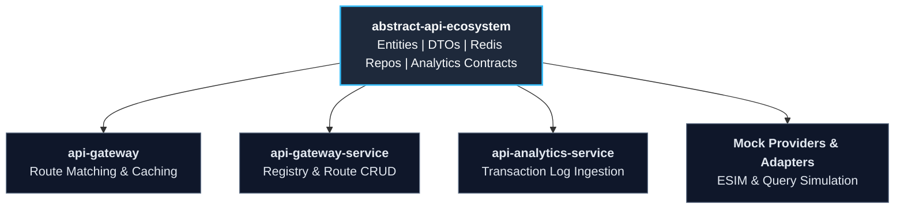

# User Manual and Deployment Guide

This guide provides technical instructions for software engineers, architects, and DevOps practitioners consuming, configuring, building, and deploying the **PICC-PC-Abstract-API-Ecosystem** (`abstract-api-ecosystem`) library.

---

## Table of Contents

1. [Overview](#1-overview)
2. [Prerequisites](#2-prerequisites)
3. [Downstream Consumption](#3-downstream-consumption)
   - [Method 1: Direct Maven Dependency](#method-1-direct-maven-dependency)
   - [Method 2: Inheriting through NNP Ecosystem](#method-2-inheriting-through-nnp-ecosystem)
4. [Maven Configuration and Repository Setup](#4-maven-configuration-and-repository-setup)
   - [Public GitHub Pages Maven Repository (Zero Token Required)](#public-github-pages-maven-repository-zero-token-required)
   - [GitHub Packages Authentication (Token Required)](#github-packages-authentication-token-required)
   - [GitLab Maven Registry (Optional)](#gitlab-maven-registry-optional)
5. [Using Core Modules and Components](#5-using-core-modules-and-components)
   - [Domain Entities and Transfer Objects](#domain-entities-and-transfer-objects)
   - [Distributed Redis Caching Repositories](#distributed-redis-caching-repositories)
   - [API Analytics and Event Contracts](#api-analytics-and-event-contracts)
   - [UUID and ID Generation](#uuid-and-id-generation)
6. [Local Build and Installation](#6-local-build-and-installation)
7. [Automated CI/CD and Release Deployment](#7-automated-cicd-and-release-deployment)
   - [Automated GitHub Actions Workflow](#automated-github-actions-workflow)
   - [Publishing a New Release](#publishing-a-new-release)
8. [Troubleshooting and Frequently Asked Questions](#8-troubleshooting-and-frequently-asked-questions)

---

## 1. Overview

`abstract-api-ecosystem` is the centralized abstraction library for API Ecosystem services across the Nubo Native Platform (NNP). It supplies:
- **Standardized Domain Entities**: Pre-defined JPA entities for API routes, registries, service providers, organizations, logs, and error reporting.
- **Contract Transfer Objects (TOs)**: Type-safe DTOs with validation rules and bidirectional entity mappers.
- **Distributed Redis Caching**: Generic HashOperations caching repository abstraction (`AbstractRedisRepo`) compatible with Jedis and Lettuce.
- **Analytics Contracts**: DTOs for capturing and aggregating API transaction metrics and analytics feeds.
- **Unified ID Generation**: Thread-safe prefixed UUID generator for platform entities.



---

## 2. Prerequisites

| Requirement | Minimum Version | Recommended Version | Verification Command |
| :--- | :--- | :--- | :--- |
| **Java JDK** | `21` (LTS) | `21.0.10+` (Temurin / OpenJDK) | `java -version` |
| **Apache Maven** | `3.9.0` | `3.9.9` (or included `./mvnw`) | `./mvnw -v` |
| **Redis** *(optional runtime)* | `6.2+` | `7.2+` | `redis-cli ping` |

---

## 3. Downstream Consumption

### Method 1: Direct Maven Dependency

Add `abstract-api-ecosystem` to your microservice's `pom.xml`:

```xml
<dependencies>
    <!-- PICC-PC-Abstract-API-Ecosystem -->
    <dependency>
        <groupId>com.nubons.nnp.sso.abstract</groupId>
        <artifactId>abstract-api-ecosystem</artifactId>
        <version>1.0.0</version>
    </dependency>
</dependencies>
```

### Method 2: Inheriting through NNP Ecosystem

If your service inherits `com.nubons:abstract-nnp` as parent POM, dependency versions (Spring Boot, Hibernate, Redis, etc.) are managed automatically.

```xml
<parent>
    <groupId>com.nubons</groupId>
    <artifactId>abstract-nnp</artifactId>
    <version>1.0.0</version>
    <relativePath/>
</parent>
```

---

## 4. Maven Configuration and Repository Setup

### Public GitHub Pages Maven Repository (Zero Token Required)

`abstract-api-ecosystem` and its parent `abstract-nnp` are published as public Maven repositories on GitHub Pages. Any developer or build pipeline can resolve artifacts without needing private tokens:

Add to your `pom.xml` or `~/.m2/settings.xml`:

```xml
<repositories>
    <!-- Public Repository for abstract-nnp -->
    <repository>
        <id>nnp-public-abstract-platform</id>
        <name>NNP Public Maven Repository - Abstract Platform</name>
        <url>https://nubo-native-platform.github.io/PICC-PC-Abstract-NNP-Platform/maven/</url>
        <releases><enabled>true</enabled></releases>
        <snapshots><enabled>false</enabled></snapshots>
    </repository>

    <!-- Public Repository for abstract-api-ecosystem -->
    <repository>
        <id>nnp-public-abstract-api-ecosystem</id>
        <name>NNP Public Maven Repository - Abstract API Ecosystem</name>
        <url>https://nubo-native-platform.github.io/PICC-PC-Abstract-API-Ecosystem/maven/</url>
        <releases><enabled>true</enabled></releases>
        <snapshots><enabled>false</enabled></snapshots>
    </repository>
</repositories>
```

### GitHub Packages Authentication (Token Required)

To publish or resolve via GitHub Packages, configure `~/.m2/settings.xml` using environment variable placeholders:

```xml
<servers>
    <server>
        <id>github</id>
        <username>${env.GITHUB_ACTOR}</username>
        <password>${env.GITHUB_TOKEN}</password>
    </server>
</servers>
```

### GitLab Maven Registry (Optional)

```xml
<servers>
    <server>
        <id>gitlab-maven</id>
        <username>${env.CI_REGISTRY_USER}</username>
        <password>${env.CI_JOB_TOKEN}</password>
    </server>
</servers>
```

---

## 5. Using Core Modules and Components

### Domain Entities and Transfer Objects

Map between database entities and Transfer Objects seamlessly:

```java
import com.nubons.nnp.sso.abs.entity.ApiOrganization;
import com.nubons.nnp.sso.abs.to.ApiOrganizationTO;

// Convert entity to TO
ApiOrganization entity = findOrgById(id);
ApiOrganizationTO to = ApiOrganizationTO.fromEntity(entity);

// Convert TO back to entity
ApiOrganization newEntity = ApiOrganizationTO.toEntity(to);
```

### Distributed Redis Caching Repositories

Create custom hash-based Redis caching repositories extending `AbstractRedisRepo`:

```java
import com.nubons.nnp.sso.abs.redis.blocking.core.AbstractRedisRepo;
import com.nubons.nnp.sso.abs.to.SampleTO;
import org.springframework.stereotype.Repository;

@Repository
public class CustomSampleRedisRepo extends AbstractRedisRepo<String, SampleTO> {

    private static final String REGION = "NNP.API-ECO.CUSTOM";

    public void put(SampleTO item) {
        repo().put(REGION, item.getId(), item);
    }

    public SampleTO get(String id) {
        return repo().get(REGION, id);
    }
}
```

Configure Redis in `application.yml`:
```yaml
spring:
  redis:
    host: ${REDIS_HOST:localhost}
    port: ${REDIS_PORT:6379}
    password: ${REDIS_PASSWORD:}
```

### API Analytics and Event Contracts

Use `ApiTransactionTO` and `ApiAnalyticsRequestTO` when sending log events to the analytics queue:

```java
import com.nubons.nnp.sso.abs.to.analytics.ApiTransactionTO;
import com.nubons.nnp.sso.abs.constants.analytics.AnalyticsConstants;

ApiTransactionTO tx = new ApiTransactionTO();
tx.setTransactionId(UUIDGenerator.generateId(APIConstants.ID_PREFIX_API_TRANSACTION));
// Send to AnalyticsConstants.ANALYTICS_QUEUE
```

---

## 6. Local Build and Installation

To build and install the library into your local Maven cache (`~/.m2/repository`):

```bash
# Clone the repository
git clone https://github.com/Nubo-Native-Platform/PICC-PC-Abstract-API-Ecosystem.git
cd PICC-PC-Abstract-API-Ecosystem

# Validate POM
./mvnw validate

# Run unit tests
./mvnw clean test

# Build and install locally
./mvnw clean install
```

On Windows, `build.bat` is also available:
```cmd
build.bat
```

---

## 7. Automated CI/CD and Release Deployment

### Automated GitHub Actions Workflow

This repository includes a fully automated GitHub Actions workflow (`.github/workflows/ci-cd.yml`):
- **Continuous Integration**: Runs on push to `main`, `master`, `develop`, and on all pull requests.
- **JDK 21 Setup**: Configures Temurin JDK 21 with Maven caching.
- **Validation & Testing**: Validates POM structure and executes test suites.
- **Public Maven Deployment**: When a release tag (`v*.*.*`) is pushed, the workflow automatically publishes the compiled JAR, source JAR, Javadoc JAR, and POM to the `gh-pages` branch under `/maven/`.

### Publishing a New Release

To release a new version (e.g. `1.0.0`):

1. Ensure `pom.xml` version matches the release version: `<version>1.0.0</version>`.
2. Commit and tag the release:
   ```bash
   git tag -a v1.0.0 -m "Release v1.0.0"
   git push origin v1.0.0
   ```
3. GitHub Actions triggers the `publish` job and updates the public GitHub Pages Maven repository.

---

## 8. Troubleshooting and Frequently Asked Questions

### Q: Maven fails with "Platform build requires Maven 3.9.0 or higher"
Use the included Maven wrapper (`./mvnw` or `mvnw.cmd`) which is pre-configured with Maven 3.9.9.

### Q: Cannot resolve `com.nubons:abstract-nnp:1.0.0`
Ensure your build references the public GitHub Pages repository:
`https://nubo-native-platform.github.io/PICC-PC-Abstract-NNP-Platform/maven/`
(Included in `.m2/settings.xml` and in the repository's `pom.xml`).

### Q: Redis connection fails on local start
Ensure `spring.redis.host` and `spring.redis.port` point to a running Redis instance or rely on the defaults (`localhost:6379`).
